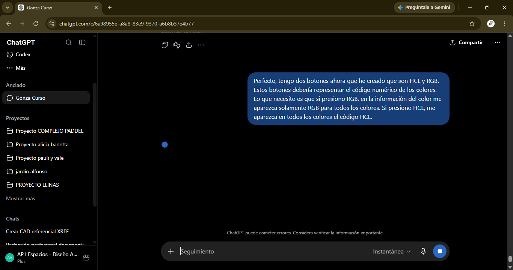

# **MI INTERACCION CON CHAT GPT**
---
La interaccion con la IA fue fundamental para implementar JAVASCRIPT a este proyecto, la redaccion de HTML, Styles y Readme fueron casi automaticas, pero los problemas aparecieron cuando tuvimos que hacer funcionar los botones.
---
## **¡Primer pedido explicito!**

### **¡No funciona mi nuevo boton!**

Cuando logre generar el boton, no podia hacerlo funcionar como tal, a simple viste el candado se bloqueaba pero luego la paleta de colores se recargaba por completo

### **Copia de codigo para analisis** 

Copie el codigo tal cual lo tenia, y el chat me marco cuales eran mis errores, y que tenia que modificar, explicando las lineas, como a un diveloper junior.

### **Primera Respuesta:** 

ChatGPT en primer lugar me indico que esta bien lo que venia desarrollando.

### **Errores detectados:** 

El primer error que me marco fue un "SIMPLE" error de codigo, en la funcion de creacion de colores RGB Y HSL, por un objetivo visual, habia borrado las siglas "rgb" y "hsl" al comienzo de la funcion. Claro, al actualizar visualmente habia cambiado el nombre tal cual lo queria ver, pero cuando recargue la paleta, ya le habia sacado la facultad de crear los colores pedidos. Esto pasa cuando priorizamos lo visual, a lo funcional.

### **Error Explicado**

Habia colocado bien la funcion, o al menos lo habia intentado; el problema fue la sobre escritura de la funcion, primero le dije mediante una funcion: bloqueame el color para que cuando genere una nueva paleta, este mismo no cambie, y luego la sobre escrifica con otra funcion que volvia a abrir el candado.

### **Removemos (.remove) el boton de las opciones de la paleta clickeando nuevamente**

Codeamos una nueva funcion para este click debajo de la *fuction* que habiamos añadido anteriormente para poder ver la paleta de colores, esta vez para quitarla. En primer lugar la colocamos debajo de toggle, addeventlistening no funcionaba para las dos functions juntas, asi que lo dejamos por fuera del cierre, y si funcionaba!

## **Prompts para hacer funcionar botones**

Pedimos ayuda para poder hacer funcionar botones ya generados.

## **Funcion para botones y coneccion de los botones a la funcion***

## **Los Botones Funcionan**

Luego de encontrar un error de Id, logramos que funcionen, transcribimos el codigo del chat, pero los botone sya estaban creados con anterioridad, por lo que el supuso que estaban creados y les dio un nombre genererico, que era parecido pero no igual; modificamos el *getElementByID* y logramos que funcionen.

